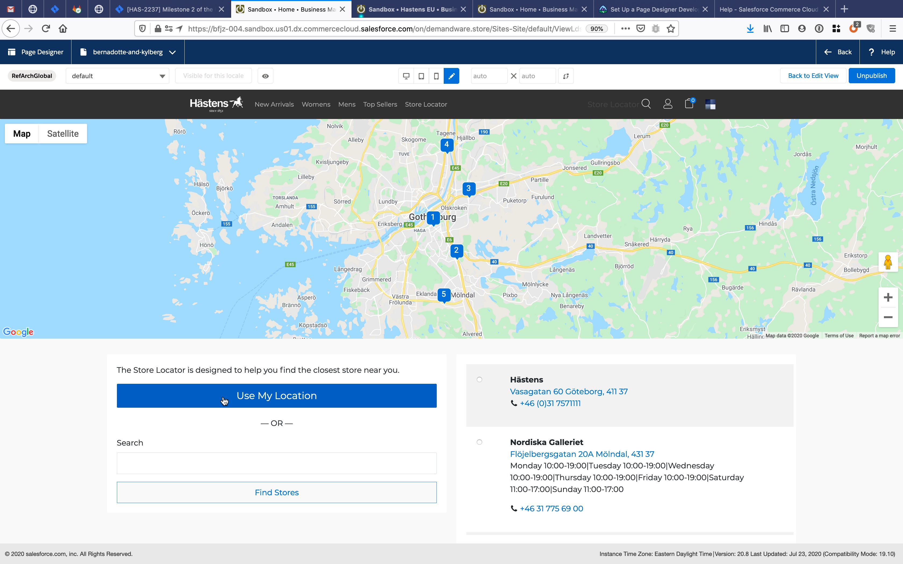
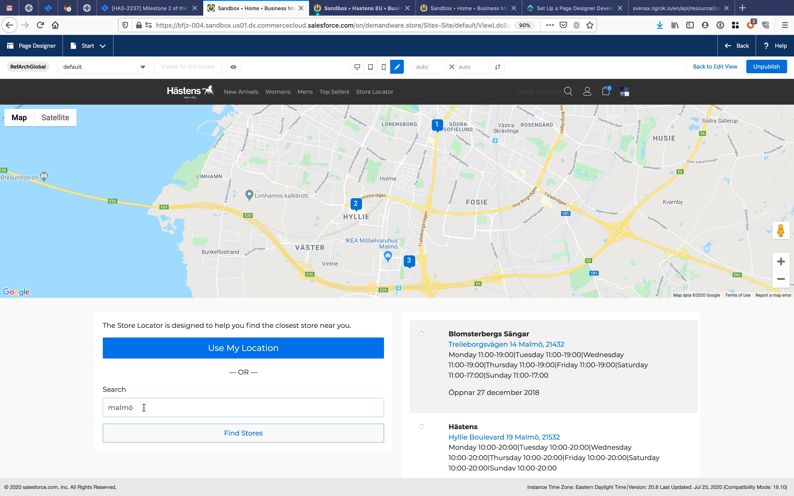
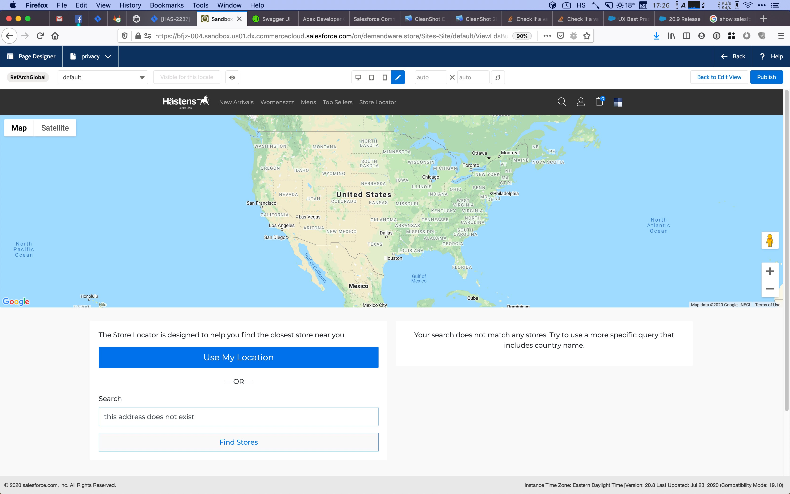

# Store Locator

The `int_hastens_storelocator` cartridge overrides the built-in store locator
to provide functionality better suited to Hästens usage.

## Setup

- Ensure that the cartridge path includes `int_hastens_storelocator`.
- Ensure that the cartridge has been uploaded.
- Ensure that geolocation data for all countries where Hästens have stores
  has been imported.
- Ensure that store information exported from polo has been imported.

## Function

We have implemented the store locator functionality on top of the default Salesforce store locator. This means that the 
standard behaviour for finding relevant stores is used. We have extended the standard store locator to use the 
Google Geolocation API to search for addresses and places where we want to find stores. 

It works like this:

Click *Use My Location* to show stores within a 10 km radius from your current location. This function uses the browsers 
geolocation, so you may have to allow access for this. There is fallback to use the location of your current IP, 
which may or may not be close to your actual location.

You can also search for any address or place. This will use the same same algorithm as Google Maps, so it tries to match 
even with misspellings etc. The stores list will be restricted to the bounds of the matched place; country, city, etc. 
If no stores are found within the bounds of the search term, we increase the search radius a few times until something 
is found. The search is always constrained to the current country.

E.g. searching for a city (Malmö in the example above) will show stores in or close to that city.
 

If the search does not correspond to a proper place or if there are no stores at all in the matched country, a message 
asking the user to try a more specific query is shown.
